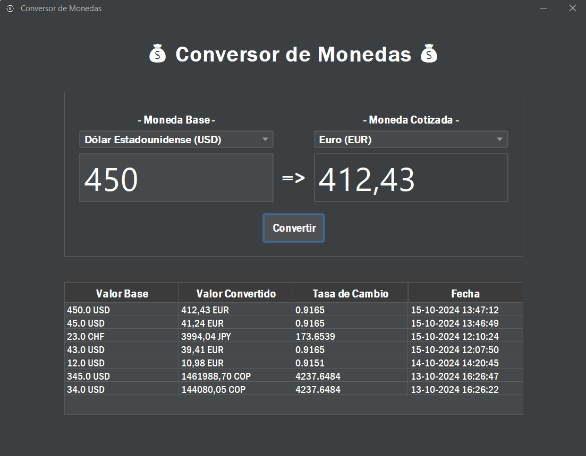

# Conversor de Monedas
[](https://www.exchangerate-api.com/)


# Índice

1. [Descripción](#descripción)
2. [Características](#características)
3. [Tecnologías](#tecnologías)
4. [API](#api)
5. [Dependencias](#dependencias)
6. [Requisitos](#requisitos)
7. [Instalación](#instalación)
8. [Uso](#uso)
9. [Captura de Pantalla de la Interfaz Gráfica](#captura-de-pantalla-de-la-interfaz-gráfica)
10. [Licencia](#licencia)
11. [Autor](#autor)

## Descripción

**Conversor de Monedas** es una aplicación Java diseñada para facilitar la conversión entre diversas monedas utilizando tasas de cambio actualizadas. La aplicación se conecta a una API externa para obtener tasas de cambio en tiempo real y almacena el historial de conversiones en un archivo **JSON**, lo que permite un acceso fácil y rápido a los datos anteriores. Además, ofrece tanto una interfaz gráfica como un modo de consola para adaptarse a diferentes preferencias de uso.


## Características

- Conversión entre múltiples monedas.
- Interfaz de usuario gráfica (GUI) y modo de consola.
- Conexión a una API para tasas de cambio actualizadas.
- Almacenamiento de conversiones en un archivo **JSON**.
- Uso de un archivo de entorno **.env** para almacenar la `API_KEY`.
- Visualización del historial de conversiones con detalles relevantes.

## Tecnologías

El **Conversor de Monedas** está desarrollado utilizando las siguientes tecnologías:

- **Java**: Lenguaje de programación principal utilizado para el desarrollo.
- **Maven**: Herramienta de gestión de proyectos y automatización de construcción.
- **JFrame**: Biblioteca para crear la interfaz gráfica de usuario.
- **API REST**: Conexión a servicios web para obtener tasas de cambio actualizadas.
- **JSON**: Formato utilizado para el almacenamiento y la manipulación de datos.


## API

La aplicación utiliza la API de [ExchangeRate-API](https://www.exchangerate-api.com/) para obtener tasas de cambio actualizadas. Para utilizar esta API, asegúrate de seguir los siguientes pasos:

1. **Registro**:
    - Visita el sitio web de ExchangeRate-API y regístrate para obtener una cuenta.
    - Una vez registrado, recibirás una `API_KEY` que se utilizará para autenticar tus solicitudes.

2. **Configuración**:
    - Asegúrate de crear un archivo `.env` en la raíz del proyecto donde puedas almacenar tu `API_KEY`:
      ```bash
      API_KEY=tu_api_key
      ```

3. **Realización de Solicitudes**:
    - La aplicación envía solicitudes HTTP GET a la API para obtener las tasas de cambio en tiempo real. Por ejemplo, puedes realizar una solicitud utilizando la siguiente URL:
      ```
      https://v6.exchangerate-api.com/v6/tu_api_key/latest/USD
      ```
    - Esto devolverá un JSON con las tasas de cambio actuales con respecto al Dólar Estadounidense (USD).

4. **Manejo de la Respuesta**:
    - El programa procesa la respuesta JSON para extraer las tasas de cambio relevantes. Esta información se utiliza para realizar las conversiones de moneda según la selección del usuario.

5. **Ejemplo de Respuesta**:
    - La respuesta de la API podría verse algo así:
      ```json
      {
        "result": "success",
        "base_code": "USD",
        "conversion_rates": {
          "EUR": 0.9165,
          "CHF": 0.862,
          "COP": 4201.023,
          "GBP": 0.7657,
          "JPY": 149.6736,
          "MXN": 19.3992
        }
      }
      ```

Al utilizar esta API, la aplicación puede proporcionar tasas de cambio precisas y actualizadas.

## Dependencias

Para el correcto funcionamiento del **Conversor de Monedas**, asegúrate de incluir las siguientes dependencias en tu proyecto:

- **Gson**: Para procesar y convertir datos entre objetos Java y JSON.
- **dotenv-java**: Para cargar configuraciones desde un archivo `.env`.
- **FlatLaf**: Para mejorar la interfaz gráfica de usuario con un diseño moderno.

Agrega estas dependencias en tu archivo `pom.xml` si utilizas Maven.

## Requisitos

- JDK 21
- Maven
- IntelliJ IDEA (o cualquier otro IDE compatible con Java)

## Instalación

1. Clona este repositorio:
   ```bash
   git clone https://github.com/william-medina/conversor-monedas.git
   ```
   
2. Navega al directorio del proyecto:
   ```bash
   cd conversor-monedas
   ```
   
3. Crea un archivo .env en la raíz del proyecto y agrega tu API_KEY:
   ```bash
   API_KEY=tu_api_key
   ```

4. Asegúrate de que todas las dependencias estén instaladas utilizando la opción de **"Actualizar Proyecto"** o **"Importar dependencias"** en tu IDE.

## Uso

### Modo de Consola

1. **Ejecuta la Aplicación**:
    - Para iniciar la aplicación en modo consola, ejecuta la clase `CurrencyConverterConsoleApp` desde tu IDE o en la línea de comandos. Esta clase contiene el método `main`, que inicia la aplicación.

2. **Menú de Conversión**:
    - Una vez iniciada la aplicación, verás el siguiente menú:
      ```
      ******************************************************
      ***             CONVERSOR DE MONEDAS               ***
      ******************************************************
 
      Selecciona una opción para realizar la conversión:
      ------------------------------------------------------
      | 1) Dólar (USD) =>> Euro (EUR)                      |
      | 2) Dólar (USD) =>> Peso colombiano (COP)           |
      | 3) Euro (EUR) =>> Dólar (USD)                      |
      | 4) Euro (EUR) =>> Peso colombiano (COP)            |
      | 5) Peso colombiano (COP) =>> Dólar (USD)           |
      | 6) Peso colombiano (COP) =>> Euro (EUR)            |
      | 7) Ingresar otras divisas manualmente              |
      | 8) Ver historial de conversiones                   |
      | 9) Salir                                           |
      ------------------------------------------------------
      ```

3. **Selecciona una Opción**:
    - Ingresa el número correspondiente a la opción deseada y presiona **Enter**.

4. **Ingresar Divisas Manualmente**:
    - Si eliges la opción para ingresar otras divisas manualmente, se te pedirá que introduzcas las monedas y la cantidad a convertir.

5. **Resultado de la Conversión**:
    - Después de ingresar los valores, el programa mostrará el resultado de la conversión en la consola.

6. **Historial de Conversiones**:
    - Si seleccionas la opción 8, se mostrará una tabla con el historial de conversiones, con un formato similar al siguiente:
      ```
      ------------------------------------------------------------------------------------
      |     Valor Base     |  Valor Convertido  |  Tasa de Cambio  |        Fecha        |
      ------------------------------------------------------------------------------------
      | 23,00 CHF          | 3994,04 JPY        | 173.6539         | 15-10-2024 12:10:24 |
      | 43,00 USD          | 39,41 EUR          | 0.9165           | 15-10-2024 12:07:50 |
      | 12,00 USD          | 10,98 EUR          | 0.9151           | 14-10-2024 14:20:45 |
      | 345,00 USD         | 1461988,70 COP     | 4237.6484        | 13-10-2024 16:26:47 |
      | 34,00 USD          | 144080,05 COP      | 4237.6484        | 13-10-2024 16:26:22 |
      ------------------------------------------------------------------------------------
      ```

### Modo Gráfico

1. **Ejecuta la Aplicación**:
    - Para iniciar la aplicación en modo gráfico, ejecuta la clase `CurrencyConverterGuiApp` desde tu IDE o en la línea de comandos. Esta clase también contiene el método `main`, que inicia la aplicación.

2. **Interfaz Gráfica**:
    - Al abrir la interfaz gráfica, verás campos para ingresar el monto a convertir, así como dos menús desplegables para seleccionar las monedas base y de cotización.

3. **Realizar una Conversión**:
    - Ingresa el monto en el campo correspondiente, selecciona las monedas deseadas y haz clic en el botón "Convertir".

4. **Resultado de la Conversión**:
    - El resultado se mostrará en el campo de salida, donde podrás ver el monto convertido.


### Captura de Pantalla de la Interfaz Gráfica


## Licencia

Este proyecto está bajo la Licencia MIT. Para más detalles, consulta el archivo [LICENSE](./LICENSE).

## Autor

**William Medina**  
Autor y desarrollador del **Conversor de Monedas**. Puedes encontrarme en [GitHub](https://github.com/william-medina)